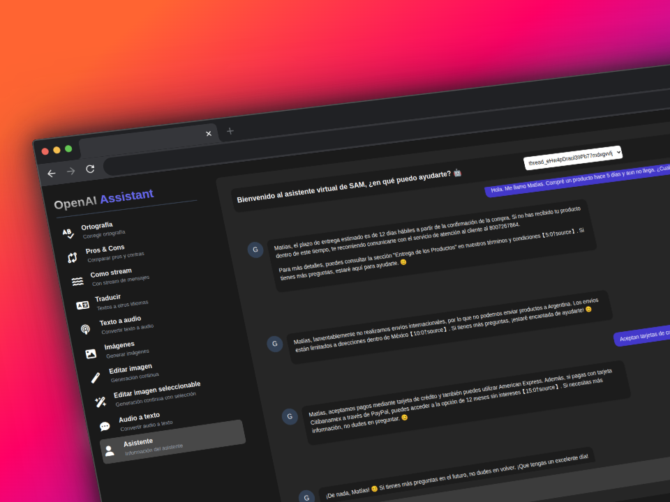
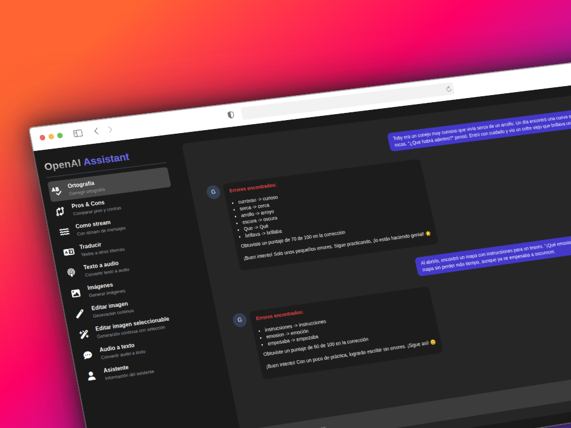
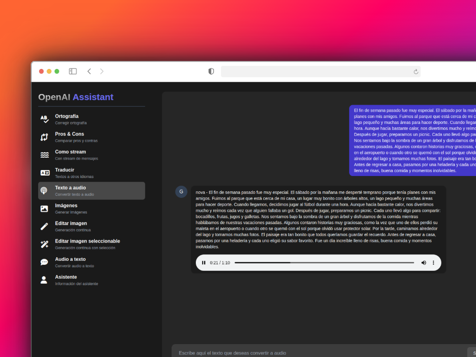
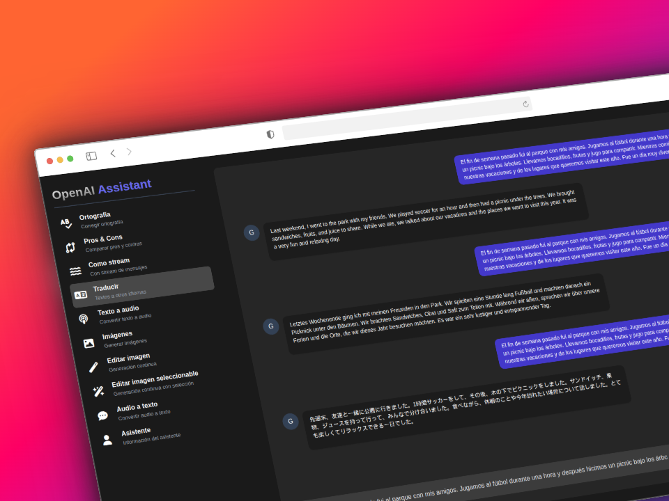
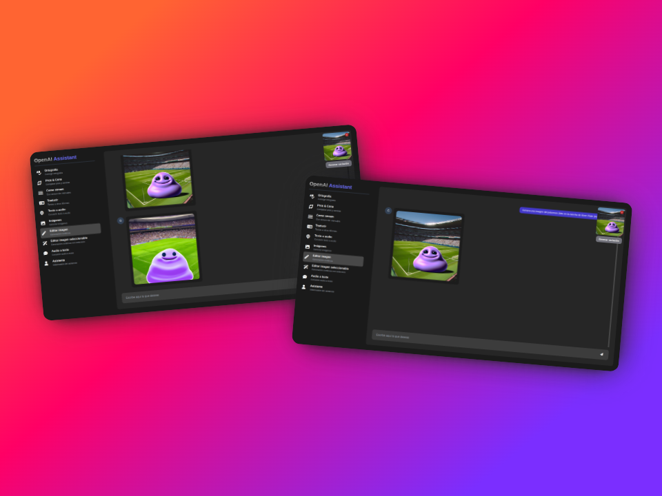

<div style="display: flex; justify-content: space-around; align-items: center;">


</div>

# OpenAI Assistant

## Descripción

Este proyecto fue desarrollado para aprender a utilizar la API de OpenAI. Se trata de una aplicación web que permite interactuar con distintos modelos de lenguaje de OpenAI y visualizar las respuestas generadas. La aplicación fue desarrollada con React.js y NestJS.

El proyecto cuenta con las siguientes funcionalidades:

- Corrector ortográfico
- Comparador (pros y contras de uno o más temas) normal y con stream
- Traductor de texto
- Generador de audio a partir de texto
- Generador de texto a partir de audio
- Generador de imágenes
- Variación de imágenes
- Edición de imágenes (a través de un canva)
- **Asistente SAM (chatbot tienda Samsung Mx)**
- _Próximamente_: Texto a partir de imágenes

## Instalación

Para instalar el proyecto, es necesario clonar el repositorio e instalar las dependencias:

```bash
# Clonar el repositorio
git clone https://github.com/matiasagbenitez/openai-assistant.git

# Instalar las dependencias del backend
cd openai-assistant/backend
npm install

# Instalar las dependencias del frontend
cd ../frontend
npm install
```

Una vez instaladas las dependencias, es necesario configurar las variables de entorno. Para ello, se debe crear un archivo `.env` en la carpeta `backend` con el siguiente contenido:

```env
OPENAI_API_KEY=
OPENAI_ASSISTANT_ID=
SERVER_URL=http://localhost:3000
```

> **Nota**: Para obtener las credenciales de OpenAI, es necesario crear una cuenta en la plataforma y obtener una API Key. Para obtener el `OPENAI_ASSISTANT_ID`, es necesario crear un asistente en la plataforma de OpenAI.

Realizamos el mismo procedimiento para el frontend, creando un archivo `.env` en la carpeta `frontend` con el siguiente contenido:

```env
VITE_GPT_API=http://localhost:3000/gpt
VITE_ASSISTANT_API=http://localhost:3000/sam-assistant
```

## Uso

Para ejecutar el proyecto, es necesario ejecutar el backend y el frontend por separado. Para ejecutar el backend, se debe ejecutar el siguiente comando en la carpeta `backend`:

```bash
npm run start:dev
```

Para ejecutar el frontend, se debe ejecutar el siguiente comando en la carpeta `frontend`:

```bash
npm run dev
```

Una vez ejecutados ambos comandos, se podrá acceder a la aplicación web en la dirección `http://localhost:5173`. El backend estará disponible en la dirección `http://localhost:3000`.

## Galería

### Asistente SAM (chatbot tienda Samsung Mx)



### Corrector ortográfico



### Texto a audio



### Traductor



### Creación y variación de imágenes



## Disclaimer

No se hizo mucho énfasis en el frontend, ya que el objetivo principal del proyecto era aprender a utilizar la API de OpenAI. Por lo tanto, el frontend puede no ser muy atractivo visualmente o su usabilidad puede no ser la mejor. No obstante, se puede mejorar fácilmente con un poco de tiempo y dedicación. Eso te lo dejo a vos 😉
